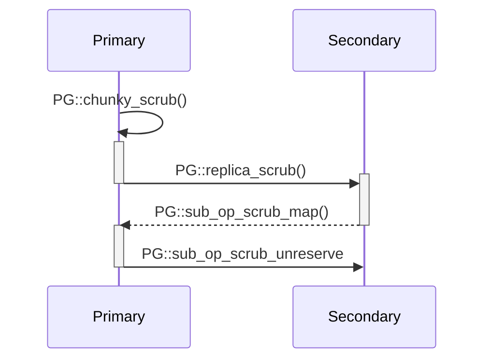

[TOC]

# 介绍

``` C++
PG
 |-- scrubber: Scrubber
 		|-- primary_scrubmap: ScrubMap
		|-- received_maps: map<pg_shard_t, ScrubMap>
```

FAQ:

1. Scrub操作是否由Primary OSD发起？Y
   PG::scrub函数检查PG是否为主PG、active+clean状态、scrubbing状态。

2. 如何区分Deep Scrub和Shallow Scrub？
3. Scrub是否有自己的消息类型，Secondary OSD如何处理该消息？
4. Scrub发现不一致的对象时，怎么处理？
5. 如何选择哪些对象参与Scrub？

```
coll_t
	|-- pgid: spg_t
		|-- pgid: pg_t
			|-- m_pool: uint64_t
```


## 配置项

| 配置项                      | 默认值             | 说明                              |
| :----------------------- | :-------------- | :------------------------------ |
| osd_scrub_chunk_min      | 5               | -                               |
| osd_scrub_chunk_max      | 25              | -                               |
| osd_deep_scrub_interval  | 60*60*24*7 (1周) | Deep scrub周期，默认一周执行一次           |
| osd_heartbeat_interval   | 6               | 周期性执行OSD::sched_scrub函数         |
| osd_scrub_begin_hour     | 0               | 允许触发Scrub的时间段的起始时间              |
| osd_scrub_end_hour       | 24              | 允许触发Scrub的时间段的结束时间，结束时间可以小于起始时间 |
| osd_scrub_auto_repair    | false           | 自动repair不一致对象。副本池**不**支持，EC池支持  |
| osd_max_scrubs           | 1               | OSD允许同时运行的Scrub任务的最大数目          |
| osd_deep_scrub_stride    | 524288          | -                               |

## 启动

```
PG
	|-- scrubber: Scrubber
	|-- scrub_reg_stamp: utime_t
	
OSDService
	|-- sched_scrub_pg: set<ScrubJob>  // Scrub任务
		|-- sched_time: utime_t  // 任务开始执行的时间
		|-- deadline: utime_t

PG::reg_next_scrub()  --> OSD::reg_pg_scrub() --> OSD::sched_scrub_pg
```
注册Scrub任务。 每个PG在适当的时候，例如用户执行 *ceph osd deep-scrub* 命令，向OSD::sched_scrub_pg注册Scrub任务。


| 配置项 | 默认值 | 说明 |
|:--|:--|:--|
| osd_scrub_interval_randomize_ratio | 0.5 | [min,min*(1+randomize_ratio)) |
| osd_scrub_min_interval | 60\*60\*24 | |
| osd_scrub_max_interval | 7\*60\*60\*24 |  |

```
OSD::init() --> C_Tick_WithoutOSDLock::finish() --> OSD::tick_without_osd_lock() -->
OSD::sched_scrub() --> PG::sched_scrub() --> PG::queue_scrub() -->
PG::requeue_scrub() --> OSD::queue_for_scrub()
```
定时器触发Scrub任务，将Scrub任务放入Op队列，等待dmClock调度执行。

OSD进程启动时将初始化一个C_Tick_WithoutOSDLock定时器，默认每隔6秒检查一次系统负荷以及当前时间是否位于允许触发Scrub的时间段内。如果条件满足，则触发Scrub任务。OSD::sched_scrub_pg保存了一组Scrub任务，当定时器被允许触发任务时将sched_scrub_pg中的Scrub任务逐个添加到Op操作队列去执行。

sched_scrub将Scrub任务入队列前，检查能否在Recovery过程中执行

| 配置项 | 默认值 | 说明 |
|:--|:--|:--|
| osd_scrub_during_recovery | true | 允许在OSD Recovery过程中执行Scrub任务 |
| osd_scrub_load_threshold | 0.5 | 只有负载低于该值时才允许触发Scrub |

Scrub任务入队列的条件：
1. 到达任务开始时间（sched_time）；
2. 有Recovery Op的情况下，检查配置是否允许同时执行Scrub任务；
3. PG位于Active状态；
4. Scrub没有超期（deadline），或者当前时间位于允许Scrub的时间段内并且系统负载在允许范围。


## 预留

```
OSD
    |-- scrubs_pending: int  // 排队的Scrub任务数目
    |-- scrubs_active: int  // 运行的Scrub任务数目
```

```
ReplicatedPG::do_request() --> ReplicatedPG::do_sub_op() --> PG::sub_op_scrub_reserve()
```
Secondary OSD处理scrub reserve请求的流程。预留取决于两点：首先，给定的PG没有被预留；其次，OSD排队的加上正在运行的Scrub任务数目不超过osd_max_scrubs。如果不满足上述两点，预留失败。osd_max_scrubs的默认值为1，也就是说一个OSD进程默认同一时刻只允许运行一个Scrub任务。

```
PG
    |-- scrubber: Scrubber
        |-- reserved: bool  // PG已被预留
        |-- reserve_failed: bool  // 预留失败，只要有1个OSD预留失败就标记为True
        |-- reserved_peers: set<pg_shard_t>  // 计数成功预留的OSD

ReplicatedPG::do_request() --> ReplicatedPG::do_sub_op_reply() --> PG::sub_op_scrub_reserve_reply() --> PG::sched_scrub()
```
Primary OSD处理scrub reserve响应的流程。reserved_peers登记已预留成功的OSD节点，如果reserved_peers大小和Acting大小相同代表所有Peer OSD均已预留成功，向ShardOp队列投递PGScrub请求。如果有一个Peer OSD预留失败，标记reserve_failed为True，清空reserved_peers，递减OSD::scrubs_pending，发送CEPH_OSD_OP_SCRUB_UNRESERVE请求给Peer OSD取消预留。

## 状态机

```
PG
    |-- scrubber: Scrubber
        |-- store: std::unique_ptr<Scrub::Store>
        |-- waiting_on: int  // 未完成Scrub的Secondary OSD的数目
        |-- waiting_on_whom: set<pg_shard_t>  // 未完成Scrub的Secondary OSD
        |-- received_maps: map<pg_shard_t, ScrubMap>  // Secondary OSD的ScrubMap
        |-- subset_last_update: eversion_t  // 影响chunk中object的最近的版本号
        |-- active_rep_scrub: OpRequestRef  // (备OSD)等待subset_last_update版本完成
```
###  INACTIVE 状态
### NEW_CHUNK状态

```
```


```
ReplicatedPG::do_request() --> PG::replica_scrub() --> build_scrub_map_chunk()
```
请求MOSDRepScrub走fast dispatch路径，回复MOSDSubOp消息。

### WAIT_PUSHES状态
### WAIT_LAST_UPDATE状态
### BUILD_MAP状态
### WAIT_REPLICAS状态
### COMPARE_MAPS状态

####  构建权威Scrub Map

```
PG::chunky_scrub() --> PG::scrub_compare_maps() --> PGBackend::be_compare_scrubmaps()
```

从一个Object的不同副本中选择一个**权威**Object，权威Object满足以下条件：首先，没有读取错误；其次，包含"_"属性，即包含object_info_t内容以及object_info_t内容正确。object_info_t中包含了Object的数据、Omap的CRC32校验。


检查Object的**一致性**。也就是，比较副本Object和权威Object是否相同，比较内容包括：

- [x] 副本Object存在。如果副本Object不存在，权威Object存在，也代表不一致。权威Object不存在代表**丢失**。
- [x] 没有读取错误和stat错误；
- [x] Object的数据、OMAP的digest相同；
- [x] 副本Object中包含了所有权威Object的attr属性，同样地，权威Object中包含副本Object的所有attr属性


PGBackend::be_compare_scrubmaps函数计算出所有不一致Object、丢失Object以及每个Object的权威OSD列表。给定Object的权威OSD列表，代表列表内的OSD间的Object是一致的。

PG::scrub_compare_maps依据权威OSD列表构建出权威Scrub Map。

### WAIT_DIGEST_UPDATES状态

### FINISH状态


```
PG::chunky_scrub() --> PG::scrub_finish() --> PG::scrub_process_inconsistent()
```

通知Secondary PG结束预留。



## 影响

```
ReplicatedPG::do_op() --> Scrubber::write_blocked_by_scrub()
```
Scrub选择参与的Object的方式是，划定一个哈希范围，同时锁定这个范围。当处理写请求时，检查目标Object是否落在该范围之内，如果恰好落在该范围内那么该Object的写请求将被阻塞，请求被放到**wait_for_active**队列。如果在范围锁定的时间段内，新建Object，那么该Object的请求也将被阻塞？

```
PG::chunky_scrub() --> PG::requeue_ops(waiting_for_active)
```
Scrub在完成Scrub Map比较时将waiting_for_active队列重新加入到OP队列，开始处理那些被阻塞的IO。


